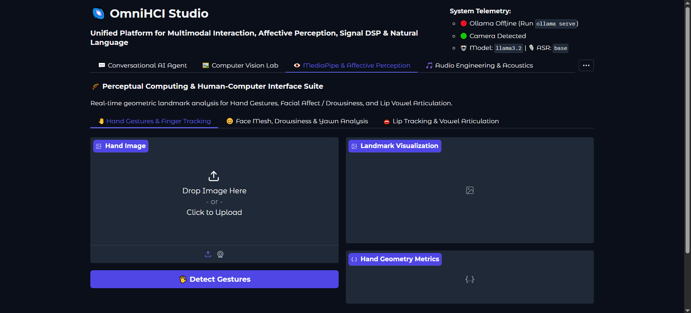

# OmniHCI Studio

[](https://www.python.org/)
[](https://gradio.app/)
[](https://opencv.org/)
[](https://developers.google.com/mediapipe)
[](https://librosa.org/)
[](https://github.com/openai/whisper)
[](https://www.nltk.org/)
[](LICENSE)

OmniHCI Studio is an integrated human-computer interaction platform unifying multimodal conversational interfaces, perceptual computing, computer vision, acoustic signal processing, and natural language understanding.

---

## Interface Preview



---

## Architecture

```
OmniHCI Studio
├── app.py                      # Application launcher
├── pyproject.toml              # Project dependencies and packaging
├── .env                        # Runtime configurations
├── docs/                       # Project documentation assets
│   └── running.png
├── data/                       # Benchmark audio samples
│   ├── speech01.wav
│   ├── speech02.mp3
│   └── speech03.mp3
└── src/                        # Core engines and interface modules
    ├── config.py               # Runtime configuration and hardware detection
    ├── agent/                  # Multimodal dialogue orchestrator
    │   └── multimodal_agent.py
    ├── vision/                 # Image processing and digital filters
    │   └── filters.py
    ├── mediapipe/              # Perceptual computing and landmark analysis
    │   ├── hands.py            # 21-point hand tracking and gesture classification
    │   ├── face_mesh.py        # 468-point face mesh, eye and mouth aspect ratios
    │   └── lips.py             # Lip geometry and vowel shape recognition
    ├── audio/                  # Speech processing and acoustic features
    │   ├── asr.py              # Whisper speech recognition and audio conversion
    │   ├── dsp.py              # Filtering, SNR estimation, VAD, and Librosa features
    │   └── tts.py              # pyttsx3 offline text-to-speech engine
    ├── nlp/                    # Linguistic analysis and classification
    │   ├── nltk_tools.py       # Tokenization, POS tagging, NER, and frequencies
    │   ├── classifier.py       # TF-IDF and Naive Bayes intent classification
    │   └── llm_nlp.py          # Zero-shot intent, sentiment, and summarization
    └── ui/                     # Modular interface tabs
        ├── tab_chat.py         # Conversational interface
        ├── tab_vision.py       # Computer vision laboratory
        ├── tab_mediapipe.py    # MediaPipe perception suite
        ├── tab_audio.py        # Audio processing and acoustics laboratory
        ├── tab_nlp.py          # Natural language processing suite
        └── tab_pipeline.py     # End-to-end multimodal pipeline
```

---

## Modules and Capabilities

### 1. Conversational Interface
- Multi-Input Fusion: Processes text, speech (microphone or audio file), and visual frames (webcam or file upload) independently or in combination.
- Dialogue Management: Manages contextual session state and turn history.
- Vocal Synthesis: Generates spoken responses using local offline text-to-speech.
- Hardware Resilience: Handles absent capture devices with soft warnings without process termination.

### 2. Computer Vision Laboratory
- Point Processing: Grayscale conversion, negative inversion, linear/nonlinear contrast stretching (Gamma, Log), Z-score and Min-Max normalization.
- Binarization: Fixed binary thresholding, Otsu's automatic thresholding, and Gaussian adaptive binarization.
- Spatial Filtering: Gaussian, median, and mean smoothing kernels with dynamic kernel sizing.
- Edge Detection: Canny edge detector, Sobel gradient magnitude (horizontal and vertical), and Laplacian second-order derivatives.
- Morphology: Dilation, erosion, opening, closing, and morphological gradient.
- Bit-Plane Slicing: Bit-plane extraction (MSB bit 7, LSB bit 0) and multi-bit reconstruction.

### 3. MediaPipe Perception Suite
- Hand Tracking: Detects 21 3D hand landmarks, computes finger extension angles, and classifies gestures (Fist, Open Hand, Thumbs Up/Down, Pointing, Peace, OK Sign, Pinch).
- Face Mesh and Fatigue Analysis: Tracks 468 landmarks, computes Eye Aspect Ratio (EAR) for blink and drowsiness detection, and Mouth Aspect Ratio (MAR) for yawn alerts.
- Lip Geometry and Visemes: Tracks outer and inner lip contours, computes aperture ratios, and classifies vowel mouth shapes (A, E, I, O, U).

### 4. Audio Processing and Acoustics
- Signal Conditioning: DC offset subtraction, pre-emphasis filtering (alpha = 0.97), peak normalization, and energy-based Voice Activity Detection (VAD).
- IIR Filtering: 5th-order Butterworth filters (Bandpass 300 Hz – 3400 Hz, Lowpass 4000 Hz, Highpass 100 Hz).
- Signal-to-Noise Ratio: Measures SNR enhancement across audio processing chains.
- Acoustic Analysis: Computes 13 MFCCs, Mel-spectrograms, spectral centroids, spectral rolloff, zero-crossing rates, RMS energy, and tempo (BPM).
- Offline Speech Synthesis: Custom speech generation with adjustable rate (WPM), volume, and voice selection.

### 5. Natural Language Processing Suite
- Linguistic Parsing: Word and sentence tokenization, stopword filtering, WordNet lemmatization, Porter stemming, Part-of-Speech tagging, and Named Entity Recognition.
- Statistical Classification: TF-IDF vectorization paired with Multinomial Naive Bayes for intent classification with evaluation metrics.
- Semantic Analysis: Zero-shot classification, entity extraction, sentiment analysis, and summarization via local language model backends.

### 6. End-to-End Multimodal Pipeline
- Continuous processing loop: Acoustic input (microphone/file) → Automatic Speech Recognition (Whisper) → Syntactic and Intent Parsing (NLTK / Scikit-Learn) → Response Generation (Ollama) → Speech Synthesis (pyttsx3).

---

## Setup and Execution

### Prerequisites
- Python 3.10 or higher
- [uv](https://github.com/astral-sh/uv) (recommended package manager)
- Local Ollama runtime (for language model execution):
  ```bash
  ollama serve
  ollama pull llama3.2
  ```

### Installation and Launch

```bash
# Synchronize environment dependencies
uv sync

# Launch the application
uv run python app.py
```

The web interface runs locally at:
```
http://localhost:7860
```

---

## Test Audio Samples

Sample audio files for testing speech recognition and acoustic analysis are located in `data/`:
- `data/speech01.wav` — Standard speech audio in WAV format.
- `data/speech02.mp3` — Speech stream in MP3 format.
- `data/speech03.mp3` — Audio query for format conversion and transcription testing.
